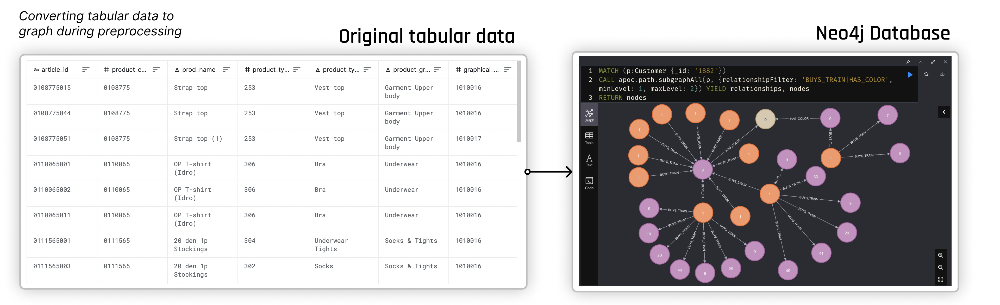

# **laplace**, a Graph Neural Network based Recommendation Engine

##### Table of Contents  
- [Overview](#Overview)  
- [Get Started](#Get_Started) 
  - [Installation & Data](#Installation) 
  - [Main Pipeline](#Main_Pipeline) 
- [Advanced Usage](#Advanced_Usage)  
    - [Hyperparameter tuning](#Hyperparameter_tuning)     
- [Further todo](#Further_todo)  
- [Recommended resources](#Recommended_resources)  

 

## Overview

**laplace** is an end-to-end ML framework to train and predict on neurally-enhanced graphs for recommendation. 

The pipeline is designed for self-supervised edge prediction on heterogenous graphs. 

 

### Features

- Two step, **Multi-model** composition:
  1. Candidate Selection
     - Integrating LightGCN recommendations (can be ran on its own aswell)
     - Multiple, custom heuristics
     - Strategies can be mixed and matched
  2. GraphConvolutional network prediction on 
- Works on **Heterogenous** graphs
  - User based training, validation and test splitting
  - N-hop neighborhood aggregation
  - Node Features 
  - Works on any number of node types
- Advanced preprocessing of tabular data into graphs
  - **Neo4j** integration for better visualization and handling of large graphs.

 
 

## Get Started

### Installation & Data
Install the environment with:

    conda env create -n fashion --file environment.yml

Activate the environment:

    conda activate fashion

Download the required data. Run the following script from terminal:

    python run-download-data.py fashion

Currently the system works with the 
- [H&M Fashion Recommendation Kaggle challenge dataset](https://www.kaggle.com/c/h-and-m-personalized-fashion-recommendations).   `python run-download-data.py fashion`
- [Movielens dataset](https://grouplens.org/datasets/movielens/)   `python run-download-data.py movielens`

 

### Main Pipeline

To run the pipeline there are four steps required:

0. Adjust Config file under `config.py -> link_pred_config` and `config.py -> preprocessing_config`
1. Run Preprocessing with `run_preprocessing.py`
2. Run Training `run_pipeline.py`
3. Save results Inference `run_submission`

 

**Step 1: Prepocessing** 

Preprocessing turns tabular data into a graph and (optionally) loads it into a `neo4j` database.

- First download data as defined in 'Get Started'
- Set preprocessing configurations in `config.py -> preprocessing_config`
- Run `run_preprocessing.py`

Data will be saved under `data/derived`.

 

*Note on neo4j:*

It is recommended to use neo4j, it is the officially supported database of laplace, by setting these parameters in `config.py`:

    preprocessing_config.save_to_neo4j = True 
    link_pred_config.neo4j = True

    
You can view the graph and run queries after running the preprocessing pipeline (it automatically starts neo4j server). 

However, if neo4j stops running you can restart it with `neo4j start` in the terminal. [More info on neo4j](https://neo4j.com/developer/getting-started-resources/).

 

**Step 2: Training** 

- Set training configurations in `config.py -> link_pred_config`
- run training with `run_pipeline.py`

 

**Step 3: Get Inference** 

- Run inference by launching `run_submission.py`

 
 

## Advanced Usage

 

### Hyperparameter tuning

wandb is integrated into laplace.

1. Create an `.env` file in the root of the project. Add your wandb api key: `WANDB_API_KEY=12345random678letters91011example121314`
2. You can configure the sweep under `sweep.yaml`
3. Then run `run_sweep.py`

 

> ! Some sweep parameters are overwritten under run_sweep.py

 
 

## Futher todo

:white_large_square Benchmark different implementation
:white_large_square Additional matchers

 
 

## Recommended resources

